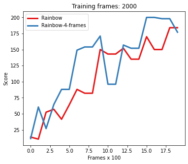
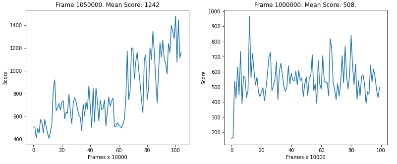

# Rainbow

This repository implements the deep reinforcement learning algorithm called **Rainbow** first developed by Deepmind. It works on both 1D and 3D inputs automatically switching between a dense or convolutional Q-network interfering the input shape. It is also possible to define a personalized input preprocessing function so to be compatible to all of the gym simulated environments and even user defined environments. **Pytorch** and **gym** need to be installed in order to run this model. Moreover, each model's component can be disabled so to compare different architectures. At present time, have been implemented the following architectures:
- DQN [[link]](https://www.cs.toronto.edu/~vmnih/docs/dqn.pdf)
- Double DQN (DDQN) [[link]](https://www.cs.toronto.edu/~vmnih/docs/dqn.pdf)
- Dueling network [[link]](https://arxiv.org/abs/1511.06581)
- Prioritized experience replay (PER) [[link]](https://arxiv.org/abs/1511.05952)
- N-Step learning [[link]](https://arxiv.org/abs/1901.07510)
- Noisy network [[link]](https://arxiv.org/abs/1706.10295)
- Categorical distribution [[link]](https://arxiv.org/pdf/1710.10044.pdf)
- Rainbow [[link]](https://arxiv.org/abs/1710.02298)

# DQN architectures comparison

To compare the performance of the 8 different architectures on the CartPole environment you can use the following command.
```
python dqn_comparison.py --num_frames 2000 --plotting_interval 1000
```
<p align="center">
</a>
</p>

# Rainbow comparison

It is also possible to compare different Rainbow architecures, the following script will evaluate two model on the CartPole Environment. The first one is a vanilla Rainbow while the second one takes as input 4 stacked observation.
```
python rainbow_comparison.py --num_frames 2000 --plotting_interval 100
```
<p align="center">
</a>
</p>

# Environment evaluation

To train and test a model on a specific environment you can refer to the notebook `dqn_env_evaluation.ipynb`. It also allows you to configure variuos hyperparameters, save and load existing models. The following image refers to the `MsPacman-v0` environment. In the figure below, the left chart depicts the training of an agent Rainbow while the right one is a simple DDQN.
<p align="center">
</a>
</p>

# Other features

- **Frame preprocessing**: it is possible to define a custom function to preprocess every input frame such as resizing, scaling, normalizing, grey-scale conversion, etc.
- **Frames temporal stack**: it gives the possibility to compose observations by stacking the last n-frames in order to add the time dimension. It is useful in that kind of environments where object directions play a fondamental role such as Pong and Breakout.
- **Early stopping**: it allows to save the DQN that during training achieved the highest average reward instead than the model at the end of training as it normally happens.
- **Reward clipping**: clips the reward between an upper and a lower bound. It helps the agent learning an effective policy rather than focusing on achieving highest scores.
- **Segment tree**: allows to efficiently store and sample transition from the Prioritized Experience Replay buffer in ln(n) time where n is the number of stored transitions.
- **Delayed training**: make the training process begins only once a certain number of transitions have been stored in order to increase their variance.
- **Batch normalization**: After each hidden layer, it follows a batch normalization layers to improve network's stability.
- **Flexible architecture**: possibility to disable one or more Rainbow extensions in order to explore different architecures.

# References
- https://github.com/Curt-Park/rainbow-is-all-you-need
